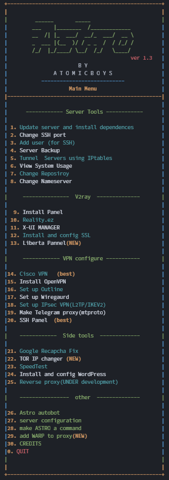

<h1 align="center"> 🚀 Astro 🚀 </h1>
<h3 align="center"> 🎗️A bash script that helps bypass GFW 🎗️</h3>

<p align="center"> 
 </p>
<p align="center">
  
</p>

 ### By Soroush Nekoozadeh

## Table of Contents


1. [Introduction](#%EF%B8%8F-introduction)
2. [Features](#-features)
3. [Installation Steps](#%EF%B8%8F-installation-steps)
4. [Support](#-support)


#
[اگر فارسی زبان هستید](https://github.com/Soroushnk/Astro/blob/main/readme-fa.md)

#
 

### Why this bash ?
It saves you time and it can do anything you want to config a server for VPN.


## ✏️ Introduction
Hi, I'm Soroush and I'm a network studier. This idea once came to my mind why do we should copy the same codes again and again to make a VPN server, a proxy server, or anything else to bypass NIN in Iran! so I made this script and I hope you enjoy it.😉


## 🧐 Features
- **Update and Upgrde server**

- **GET ssl for server**

- **install several xray panels like x-ui 3x-ui hiddify and ...**

- **Config server for cisco openconnect (use another script)**

- **Config server for openvpn (use another script)**

- **Make a tunnel using iptalbes**

- **Change ssh port**
  
- **Change Repository**
  
- **Change nameservers**

- **Config server for mtproto proxy**

- **install and config wordpress**

- **Speedtest**

- **Cloudflare white IP scanner**

- **Run reverse proxy using nginxs**

- **Config firewall server**

- **Config Wiregaurd**

- **Config Outline**

- **Server Backup**
- 
- **Sync two servers**

- **View system usage**

- **Set up IPsec VPN**
## Requirement
You just need at least ubuntu 20.04 ()on a VPS. easy !! (It runs on previous versions of ubuntu as well. But his is a preliminary version)

You can test it on other OS's like debian. 


## 🛠️ Installation Steps

1. You can simply run code by using code below 

```bash
bash <(curl -Ls https://raw.githubusercontent.com/Soroushnk/Astro/main/Astro.sh)
```
Or :

1. First you should download the script usingone of the codes  below :

a.
```bash
wget https://raw.githubusercontent.com/Soroushnk/Astro/main/Astro.sh

```
 b.

(This will download the hole repository) 
```bash
git clone https://github.com/Soroushnk/Astro.git
cd Astro
```
2. Then you should make the file runable by using code below

```bash
chmod +x Astro.sh
```
3. After that you should run the bash with one of the codes below

```bash 
./Astro.sh
```
Or: 

```bash 
bash Astro.sh
```
4. If you have any error running the file just run the code below
 
```bash 
sed -i -e 's/\r$//' Astro.sh
./Astro.sh
```

🌟 You are all set. enjoy !!

## 🙏 Support
<p align="left"> <a href="https://twitter.com/soroush_nk80" target="blank"></a> </p>
 
<h3 align="left">Support by creditcard :</h3>
<p><a href="https://www.buymeacoffee.com/snekoozadeh"> </a></p><br><br>

<h3 align="left">Or with Crypto :</h3>

```shell
Ether (Aurora Mainnet): 0x997DC6f235797221f5CB1c89127a619277d85d09 
```
```shell
Ethereum (Mainnet) : 0x997DC6f235797221f5CB1c89127a619277d85d09
```
```shell
Tether (POS - wormhole) : Bi5GizsJtvrc4mLcBruAQan78Lq4PC4XAjEAwLPMPz64
```


- 🔭 I’m currently working on [Astro](https://github.com/Soroushnk/Astro)

- 🌱 I’m currently learning **networking**

- 👯 I’m looking to collaborate on **GFWresearch**

- 📫 How to reach me : **soroush.nk80@gmail.com**

<h3 align="left">Connect with me:</h3>
<p align="left">
<a href="https://twitter.com/soroush_nk80" target="blank"></a>
</p>

<h3 align="left">Languages and Tools used:</h3>
<p align="left"> <a href="https://www.gnu.org/software/bash/" target="_blank" rel="noreferrer">  </a> </p>


